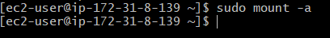
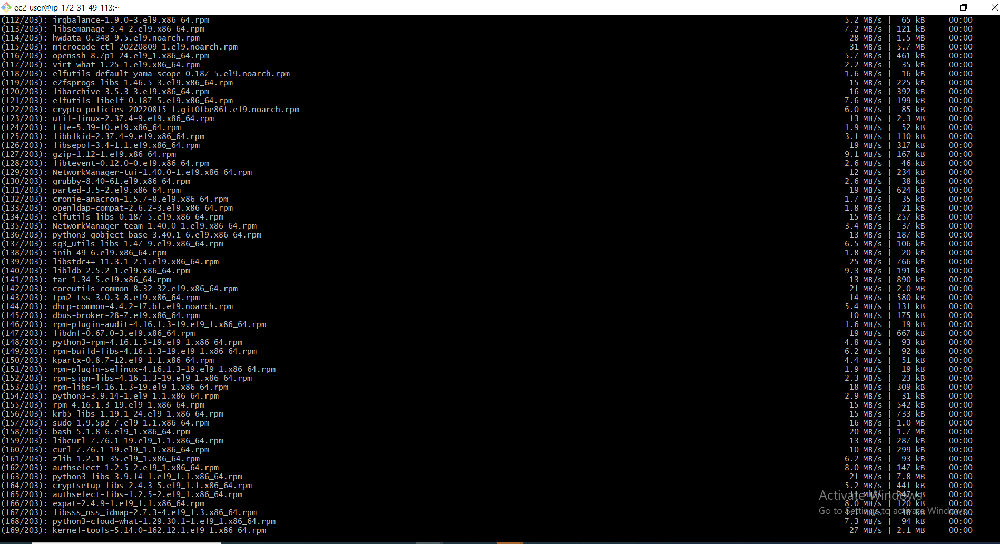
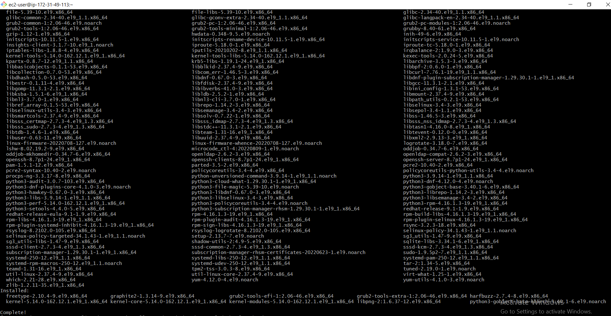
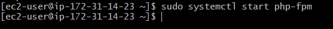
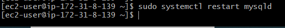
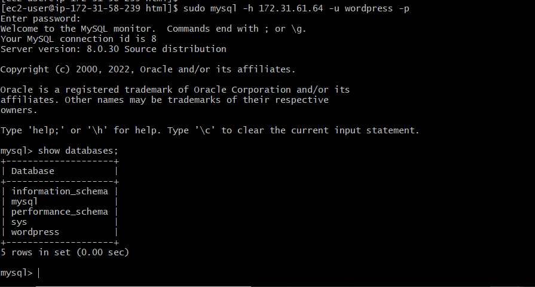

##  **PROJECT 6 - WEB SOLUTION WITH WORDPRESS**

## STEP 1 – PREPARATION OF WEB-SERVER

### WEB-server instance created and EBS volumes were attached

### lsblk command was used to confirmed the attached volumes to the web-server

`lsblk`

### Confirming the mounts and free space on my web-server

`df -h`

### Creation of the partitions on the disks earlier created

`sudo gdisk /dev/xvdf`

`sudo gdisk /dev/xvdg`

`sudo gdisk /dev/xvdh`

### Using lsblk utility to confirm the newly configured partitions on te disk

`lsblk`

### Installation of lvm2

`sudo yum install lvm2`

### Physical volumes creation

`sudo pvcreate /dev/xvdf1 /dev/xvdg1 /dev/xvdh1`

### Verifying physical volumes created

`sudo pvs`

### Using vgcreate utility to add PVs created to a volume group called webdata-vg

`sudo vgcreate webdata-vg /dev/xvdh1 /dev/xvdg1 /dev/xvdf1`

`sudo vgs`

### Using lvcreate utility to create logical volume

`sudo lvcreate -n apps-lv -L 14G webdata-vg`

`sudo lvcreate -n logs-lv -L 14G webdata-vg`

### Verifying logical volume created

`sudo lvs`

### Verifying the set up so far

`sudo vgdisplay -v`

`sudo lsblk`

### Creation of filesystem

`sudo mkfs -t ext4 /dev/webdata-vg/apps-lv`

`sudo mkfs -t ext4 /dev/webdata-vg/logs-lv`

### Creation of /var/www/html directory to store website files

`sudo mkdir -p /var/www/html`

### Creation of /home/recovery/logs to store backup of log data

`sudo mkdir -p /home/recovery/logs`

### Mounting on logical volumes created earlier

`sudo mount /dev/webdata-vg/apps-lv /var/www/html/`

### Using rsync utility to backup all the file in the log directory /var/log into /home/recovery/logs, which is required before mounting the file system

`sudo rsync -av /var/log/. /home/recovery/logs/`

### Mounting /var/log on logs-lv logical volume which will cause contents on /var/log to be deleted and the reason for the preceeding step to backup its content

`sudo mount /dev/webdata-vg/logs-lv /var/log`

### Restoring log files back into /var/log directory

`sudo rsync -av /home/recovery/logs/. /var/log`

### Updating /etc/fstab file so that the mount configuration will persist after restart of the server

### Firstly, checking for the block ID

`sudo blkid`

`sudo vi /etc/fstab`

### Testing the configuration and daemon-reload

`sudo mount -a`

`sudo systemctl daemon-reload`

## STEP 2 – PREPARATION OF DATABASE-SERVER

### DATABASE-server instance created and EBS volumes were attached

### lsblk command was used to confirmed the attached volumes to the db-server

`lsblk`

### Confirming the mounts and free space on my database-server

`df -h`

### Creation of the partitions on the disks earlier created

`sudo gdisk /dev/xvdf`

`sudo gdisk /dev/xvdg`

`sudo gdisk /dev/xvdh`

### Using lsblk utility to confirm the newly configured partitions on the disk

`lsblk`

### Installation of lvm2

`sudo yum install lvm2`

### Physical volumes creation

`sudo pvcreate /dev/xvdf1 /dev/xvdg1 /dev/xvdh1`

### Verifying physical volumes created

`sudo pvs`

### Using vgcreate utility to add PVs created to a volume group called webdata-vg

`sudo vgcreate webdata-vg /dev/xvdh1 /dev/xvdg1 /dev/xvdf1`

`sudo vgs`

### Using lvcreate utility to create logical volume

`sudo lvcreate -n db-lv -L 20G vg-database`

### Verifying logical volume created

`sudo lvs`

### Creation of mount point

`sudo mkdir /db`

### Verifying the set up so far

`sudo vgdisplay -v`

`sudo lsblk`

### Creation of filesystem

`sudo mkfs.ext4 /dev/vg-database//db-lv`

### Mounting on db

`sudo mount /dev/vg-database/db-lv /db`

### Confirming the mounting

`df -h`

### Updating /etc/fstab file so that the mount configuration will persist after restart of the server

### Firstly, checking for the block ID

`sudo blkid`

`sudo vi /etc/fstab`

### Testing the configuration and daemon-reload

`sudo mount -a`

`sudo systemctl daemon-reload`

## STEP 3 – INSTALLATION OF WORDPRESS ON WEB-SERVER

### Updating the repository

`sudo yum -y update`

### Installing wget, Apache and it's dependencies

`sudo yum -y install wget httpd php php-mysqlnd php-fpm php-json`

### Enabling and starting Apache

`sudo systemctl enable httpd`

`sudo systemctl start httpd`

### Installation of PHP and it's dependencies

`sudo yum install https://dl.fedoraproject.org/pub/epel/epel-release-latest-9.noarch.rpm`

`sudo yum install yum-utils http://rpms.remirepo.net/enterprise/remi-release-9.rpm`

`sudo yum module list php`

`sudo yum module reset php`

`sudo yum module enable php:remi-7.4`

`sudo yum install php php-opcache php-gd php-curl php-mysqlnd`

`sudo systemctl start php-fpm`

`sudo systemctl enable php-fpm`

`setsebool -P httpd_execmem 1`

![sudo-setsebool(./images/sudo-setsebool.PNG)

### Restarting apache

`sudo systemctl restart httpd`

### Downloading wordpress, extracting and copying wordpress to var/www/html

`mkdir wordpress`

`cd wordpress`

`sudo wget http://wordpress.org/latest.tar.gz`

`sudo tar xzvf latest.tar.gz`

`sudo rm -rf latest.tar.gz`

`sudo cp wordpress/wp-config-sample.php wordpress/wp-config.php`

`sudo cp -R wordpress /var/www/html/`

### Configuring security-enhanced linux policies for redhat 

`sudo chown -R apache:apache /var/www/html/wordpress`

`sudo chcon -t httpd_sys_rw_content_t /var/www/html/wordpress -R`

`sudo setsebool -P httpd_can_network_connect=1`

web-chown-to-apache
## STEP 4  – INSTALLATION OF MYSQL ON DATABASE-SERVER

### MYSQL installation

`sudo yum update`

`sudo yum install mysql-server`

### Restart and enable mysqld services and then verify they are up and running

`sudo systemctl restart mysqld`

`sudo systemctl enable mysqld`

`sudo systemctl status mysqld`

## STEP 5 – CONFIGURATION OF DATABASE-SERVER TO WORK WITH WORDPRESS

### MYSQL installation

`sudo yum update`

`sudo mysql`

## STEP 6 – CONFIGURATION OF WORDPRESS TO CONNECT TO REMOTE SERVER

### MYSQL installation

`sudo yum update`

`sudo mysql`

### Setting of binding address on database-server

`sudo vi /etc/my.cnf`

### Web-server setting of php config

`sudo vi wp-config.php`

### De activating the appache test page

`sudo mv /etc/httpd/conf.d/welcome.conf /etc/httpd/conf.d/welcome.conf_backup`

### Connecting to the database-server from Web-server

`sudo mysql -h 192.31.61.64 -u wordpress -p`

### Accessing wordpress link via browser

[wordpress link](https://3.86.13.146/wp-admin/)

